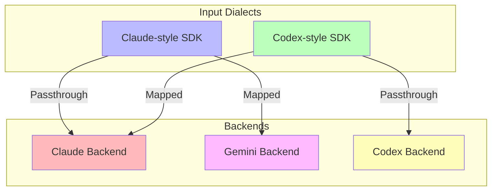
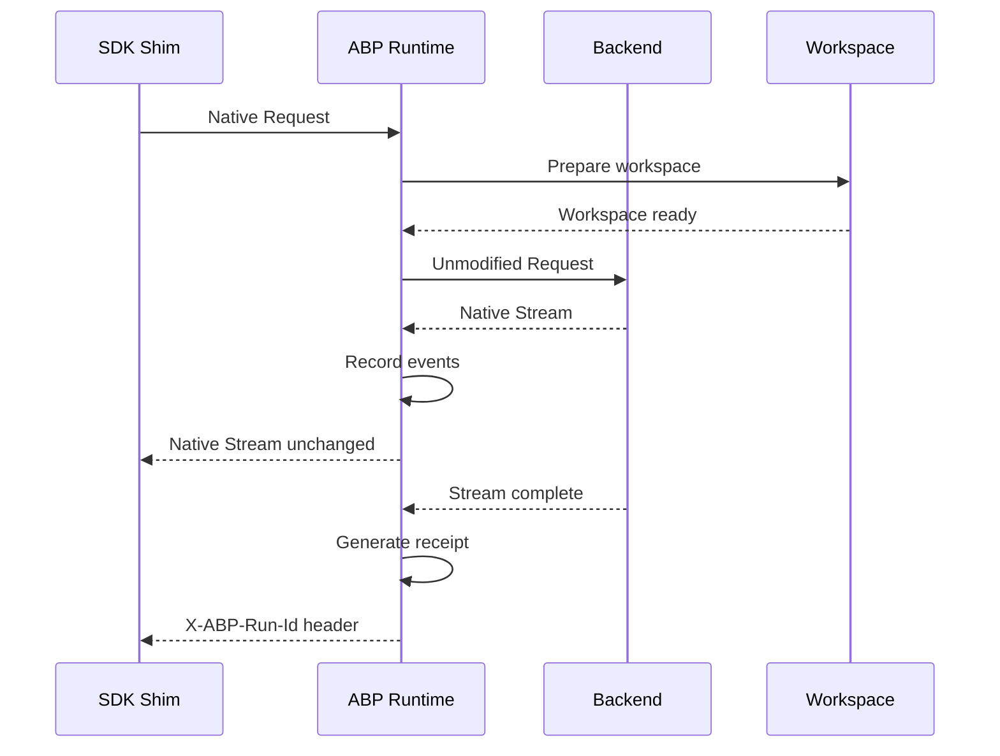
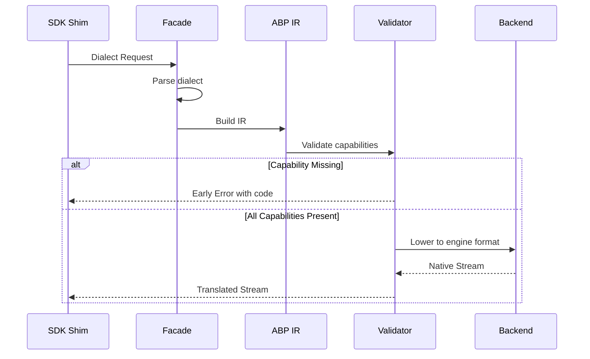
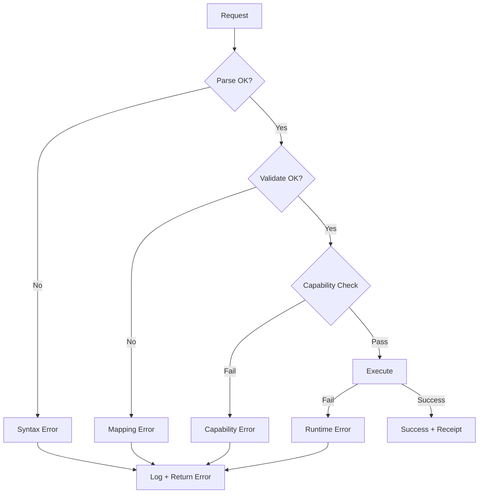
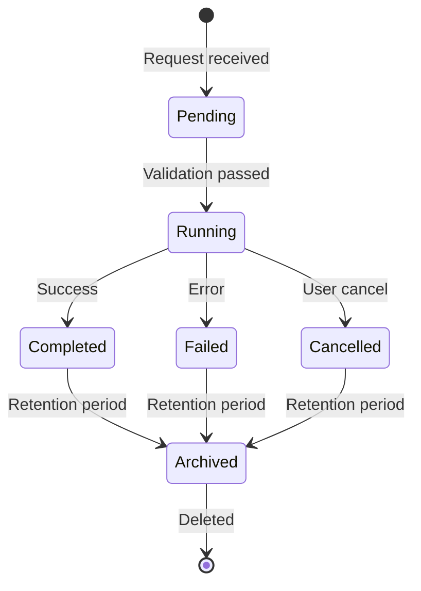
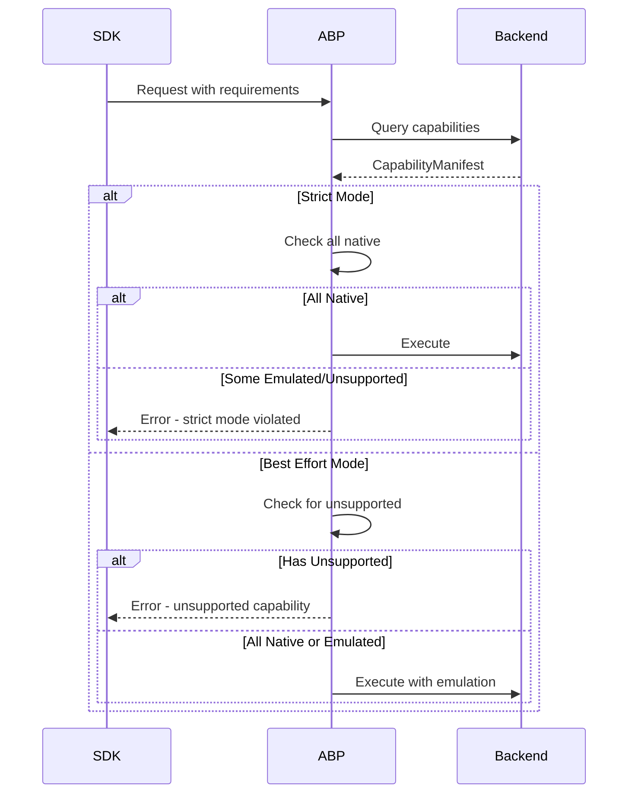

# Dialect×Engine Matrix Design

This document defines the four-case routing model for Agent Backplane, specifying how different SDK dialects map to different backend engines.

## A. The Matrix

The fundamental routing decision in ABP is determined by the intersection of **Dialect** and **Engine**:

| Dialect | Engine | Mode | Guarantee |
|---------|--------|------|-----------|
| Claude-style | Claude | Passthrough | No request rewriting |
| Claude-style | Gemini | Mapped | Opinionated mapping, early errors |
| Codex-style | Claude | Mapped | Opinionated mapping, early errors |
| Codex-style | Codex | Passthrough | No request rewriting |

### Visual Representation



### Dialect Definitions

**Claude-style Dialect:**

- SDKs following Anthropic's API conventions
- Examples: Anthropic SDK, Claude Code CLI
- Key characteristics:
  - System/user/assistant message roles
  - Tool use blocks with `tool_use_id`
  - Streaming with content blocks
  - Extended thinking tokens

**Codex-style Dialect:**

- SDKs following OpenAI's API conventions
- Examples: OpenAI SDK, Azure OpenAI, many compatible APIs
- Key characteristics:
  - System/user/assistant message roles
  - Function calling with `function_call` structure
  - Streaming deltas
  - JSON mode for structured output

### Engine Definitions

**Claude Engine:**

- Anthropic's Claude API
- Native capabilities: Extended thinking, tool use, vision
- Streaming: SSE-based content blocks

**Gemini Engine:**

- Google's Gemini API
- Native capabilities: 1M context, grounding, code execution
- Streaming: SSE-based deltas

**Codex Engine:**

- OpenAI's GPT models
- Native capabilities: Function calling, vision, JSON mode
- Streaming: SSE-based chunk deltas

## B. Passthrough Mode Definition

### Core Principle

> **Passthrough is lossless**: dialect payload and result stream are bitwise-equivalent after removing ABP's outer framing.

### What Passthrough Means

Passthrough does NOT mean "no modifications" - it means:

1. **ABP as Observer + Recorder Only**
   - Request is wrapped but not transformed
   - Response stream is observed but not altered
   - All modifications are out-of-band

2. **Lossless Wrapping**
   ```
   Original Request → ABP Envelope → Backend → Raw Response → ABP Receipt → Caller
   ```

3. **Stream Equivalence**
   - Caller receives same stream type as vendor SDK
   - Event order preserved
   - Token deltas unchanged

### What ABP Adds in Passthrough

| Component | Description | In-band/Out-of-band |
|-----------|-------------|---------------------|
| Workspace Environment | Staging, git harness | Out-of-band |
| Observability | Logging, tracing | Out-of-band |
| Receipts | Execution record | Out-of-band |
| Policy Enforcement | Consent gates | Out-of-band |
| Error Recovery | Retry logic | Out-of-band |

### Passthrough Flow



### Passthrough Guarantees

1. **Request Fidelity**: Payload sent to backend is byte-identical to shim input
2. **Response Fidelity**: Stream events match vendor SDK exactly
3. **No Injection**: ABP never injects content into the stream
4. **Receipt Availability**: Receipt accessible via out-of-band mechanism

### When Passthrough Applies

Passthrough mode is used when:

- Dialect matches Engine natively
- No capability translation required
- SDK expects vendor-native behavior
- Testing against vendor SDK baseline

## C. Mapped Mode Definition

### Core Principle

> **Mapped is explicitly lossy**: capability mismatches fail early with typed errors.

### Mapping Architecture

```
Dialect Request → Dialect Parser → ABP IR → Engine Lowering → Engine Request
                                    ↓
                          Capability Validation
                                    ↓
                          Early Failure or Proceed
```

### Two-Stage Validation

**Stage 1: Facade Validation**

Occurs at shim layer before any backend interaction:

```rust
fn validate_facade(request: &DialectRequest) -> Result<(), MappingError> {
    // Check dialect syntax
    // Validate required fields
    // Identify unsupported features
}
```

**Stage 2: Runtime Capability Check**

Occurs after backend selection:

```rust
fn validate_capabilities(
    ir: &AbpIr,
    backend: &dyn Backend
) -> Result<(), MappingError> {
    for capability in ir.required_capabilities() {
        match backend.supports(capability) {
            SupportLevel::Native => continue,
            SupportLevel::Emulated => {
                if ir.requires_native(capability) {
                    return Err(MappingError::RequiresNative(capability));
                }
            }
            SupportLevel::Unsupported => {
                return Err(MappingError::UnsupportedCapability(capability));
            }
        }
    }
    Ok(())
}
```

### Mapping Flow



### Opinionated Mapping Rules

**Claude-style → Gemini:**

| Claude Concept | Gemini Equivalent | Notes |
|----------------|-------------------|-------|
| Extended thinking | Not available | Error if required |
| Tool use blocks | Function declarations | Format translation |
| Image blocks | Inline data parts | Format translation |
| System message | System instruction | Location change |

**Codex-style → Claude:**

| Codex Concept | Claude Equivalent | Notes |
|---------------|-------------------|-------|
| Function call | Tool use block | Format translation |
| JSON mode | Forced tool use | Different mechanism |
| Stream deltas | Content blocks | Aggregation required |
| Logprobs | Not available | Error if requested |

### Early Failure Guarantee

Mapped mode MUST fail before execution if:

1. Required capability not supported by backend
2. Feature cannot be emulated
3. Mapping would lose critical information
4. Policy prohibits the operation

## D. Error Taxonomy

### Error Categories

```rust
pub enum MappingError {
    /// Feature exists in dialect but not in target engine
    UnsupportedFeature {
        feature: String,
        dialect: Dialect,
        engine: Engine,
    },
    
    /// Tool not available in target engine
    UnsupportedTool {
        tool_name: String,
        available_alternatives: Vec<String>,
    },
    
    /// Cannot uniquely map the request
    AmbiguousMapping {
        reason: String,
        possible_interpretations: Vec<String>,
    },
    
    /// Operation requires user approval
    RequiresInteractiveApproval {
        operation: String,
        risk_level: RiskLevel,
    },
    
    /// Operation blocked by policy
    UnsafeByPolicy {
        operation: String,
        policy_rule: String,
    },
    
    /// Backend missing required capability
    BackendCapabilityMissing {
        capability: Capability,
        support_level: SupportLevel,
    },
    
    /// Backend unavailable
    BackendUnavailable {
        backend_id: String,
        reason: String,
    },
}
```

### Error Codes

| Error | Code | HTTP Status | Retryable |
|-------|------|-------------|-----------|
| UnsupportedFeature | `E001` | 400 | No |
| UnsupportedTool | `E002` | 400 | No |
| AmbiguousMapping | `E003` | 400 | No |
| RequiresInteractiveApproval | `E004` | 403 | Yes |
| UnsafeByPolicy | `E005` | 403 | No |
| BackendCapabilityMissing | `E006` | 501 | No |
| BackendUnavailable | `E007` | 503 | Yes |

### Error Response Format

```json
{
  "error": {
    "code": "E001",
    "type": "UnsupportedFeature",
    "message": "Extended thinking is not supported by Gemini backend",
    "details": {
      "feature": "extended_thinking",
      "dialect": "claude-style",
      "engine": "gemini",
      "documentation_url": "https://docs.abp.dev/errors/E001"
    },
    "request_id": "req_abc123",
    "timestamp": "2024-01-15T10:30:00Z"
  }
}
```

### Error Handling Flow



## E. Receipt Surfacing Pattern

### Core Principle

> **Receipts are out-of-band**: don't break "indistinguishable" by injecting receipt into stream.

### Receipt Access Methods

**1. X-ABP-Run-Id Header**

Every response includes a run ID:

```
HTTP/1.1 200 OK
X-ABP-Run-Id: run_abc123def456
Content-Type: text/event-stream
```

**2. abp.getReceipt Helper**

SDK shims provide a helper to fetch receipts:

```typescript
// In SDK shim
const stream = await client.messages.create({...});
const runId = stream.headers.get('X-ABP-Run-Id');

// Later, fetch receipt
const receipt = await abp.getReceipt(runId);
console.log(receipt.usage);
console.log(receipt.artifacts);
```

**3. Callback/Event Sink**

For proactive receipt delivery:

```typescript
const client = new AbpClient({
  onReceipt: (receipt) => {
    // Store in database
    // Send to analytics
    // Update UI
  }
});
```

### Receipt Structure

```rust
pub struct Receipt {
    /// Unique identifier for this run
    pub id: Uuid,
    
    /// Contract version for compatibility
    pub contract_version: String,
    
    /// Timestamps
    pub started_at: DateTime<Utc>,
    pub completed_at: DateTime<Utc>,
    
    /// Execution summary
    pub status: ReceiptStatus,
    pub task: String,
    
    /// Resource usage
    pub usage: Usage,
    
    /// Backend that handled the request
    pub backend: BackendInfo,
    
    /// Workspace changes
    pub workspace_delta: Option<WorkspaceDelta>,
    
    /// Tool invocations
    pub tool_calls: Vec<ToolCallRecord>,
    
    /// Artifacts produced
    pub artifacts: Vec<Artifact>,
    
    /// Integrity hash
    pub receipt_sha256: String,
}
```

### Receipt Lifecycle



### Out-of-Band Guarantee

The receipt MUST NOT:

1. Inject events into the response stream
2. Modify stream content in any way
3. Delay stream delivery for receipt generation
4. Require caller to wait for receipt

The receipt MUST:

1. Be asynchronously generated
2. Be retrievable by run ID
3. Contain complete execution record
4. Be tamper-evident via hash

## F. Capability Negotiation

### Support Levels

```rust
pub enum SupportLevel {
    /// Feature supported natively by backend
    Native,
    
    /// Feature can be emulated with acceptable fidelity
    Emulated,
    
    /// Feature not available
    Unsupported,
}
```

### Capability Manifest

Each backend advertises capabilities:

```rust
pub struct CapabilityManifest {
    pub streaming: SupportLevel,
    pub tools: SupportLevel,
    pub vision: SupportLevel,
    pub web_search: SupportLevel,
    pub code_execution: SupportLevel,
    pub structured_output: SupportLevel,
    pub session_resume: SupportLevel,
    pub extended_thinking: SupportLevel,
    // ... additional capabilities
}
```

### Compatibility Flag

```rust
pub struct RequestOptions {
    /// How strictly to enforce capability matching
    pub compatibility: CompatibilityMode,
}

pub enum CompatibilityMode {
    /// Fail if any capability is not native
    Strict,
    
    /// Allow emulation, fail only on unsupported
    BestEffort,
}
```

### Negotiation Flow



### Capability Matrix Example

| Capability | Claude | Gemini | Codex |
|------------|--------|--------|-------|
| Streaming | Native | Native | Native |
| Tools | Native | Native | Native |
| Vision | Native | Native | Native |
| Web Search | Emulated | Native | Emulated |
| Code Execution | Unsupported | Native | Unsupported |
| Extended Thinking | Native | Unsupported | Unsupported |
| JSON Mode | Emulated | Native | Native |

## G. Conformance Test Strategy

### Test Categories

**1. Passthrough Parity Tests**

Verify stream equivalence with vendor SDK:

```rust
#[test]
fn passthrough_parity_claude_to_claude() {
    let request = claude_request();
    
    // Direct vendor SDK call
    let vendor_stream = claude_sdk::stream(request.clone());
    let vendor_events = collect_events(vendor_stream);
    
    // ABP passthrough
    let abp_stream = abp::stream(request, Backend::Claude);
    let abp_events = collect_events(abp_stream);
    
    // Strip ABP framing
    let abp_events = strip_abp_framing(abp_events);
    
    assert_eq!(vendor_events, abp_events);
}
```

**2. Mapped Contract Tests**

Verify mapping behavior:

```rust
#[test]
fn mapped_unsupported_feature_fails_early() {
    let request = claude_request_with_extended_thinking();
    
    let result = abp::stream(request, Backend::Gemini);
    
    assert!(matches!(
        result.err(),
        Some(MappingError::UnsupportedFeature { .. })
    ));
    
    // Verify no backend call was made
    assert!(!backend_was_called());
}

#[test]
fn mapped_capability_emulation_works() {
    let request = codex_request_with_json_mode();
    
    let result = abp::stream(request, Backend::Claude);
    
    assert!(result.is_ok());
    // Verify JSON output was enforced via tool use
}
```

**3. Receipt Correctness Tests**

```rust
#[test]
fn receipt_contains_all_events() {
    let request = sample_request();
    
    let (stream, run_id) = abp::stream_with_run_id(request);
    let events = collect_events(stream);
    
    let receipt = abp::get_receipt(run_id).wait();
    
    // Verify receipt captures all events
    assert_eq!(events.len(), receipt.event_count);
    assert!(receipt.receipt_sha256.is_valid());
}

#[test]
fn receipt_hash_is_deterministic() {
    let request = sample_request();
    
    let receipt1 = run_and_get_receipt(request.clone());
    let receipt2 = run_and_get_receipt(request);
    
    // Same inputs should produce same hash
    // (assuming deterministic backend behavior)
    assert_eq!(receipt1.receipt_sha256, receipt2.receipt_sha256);
}
```

### Test Matrix

| Test Type | Claude→Claude | Claude→Gemini | Codex→Claude | Codex→Codex |
|-----------|---------------|---------------|--------------|-------------|
| Parity | ✓ | - | - | ✓ |
| Early Failure | - | ✓ | ✓ | - |
| Capability Check | ✓ | ✓ | ✓ | ✓ |
| Receipt Gen | ✓ | ✓ | ✓ | ✓ |
| Error Codes | ✓ | ✓ | ✓ | ✓ |

### Continuous Conformance

```yaml
# ci.yml
conformance-tests:
  schedule: daily
  steps:
    - name: Fetch latest vendor SDK versions
      run: update-sdk-versions
    
    - name: Run parity tests
      run: cargo test --package abp-conformance -- parity
    
    - name: Run mapping tests
      run: cargo test --package abp-conformance -- mapped
    
    - name: Compare receipts
      run: cargo test --package abp-conformance -- receipt
    
    - name: Alert on regression
      if: failure()
      run: notify-team
```

## Key Principles Summary

### 1. Passthrough is Lossless

> Dialect payload and result stream are bitwise-equivalent after removing ABP's outer framing.

- No content modification
- No event injection
- Stream type matches vendor SDK
- Receipts delivered out-of-band

### 2. Mapped is Explicitly Lossy

> Capability mismatches fail early with typed errors.

- Validation before execution
- Typed error codes
- Clear documentation of limitations
- No silent degradation

### 3. Receipts are Out-of-Band

> Don't break "indistinguishable" by injecting receipt into stream.

- X-ABP-Run-Id header
- abp.getReceipt helper
- Optional callbacks
- Asynchronous generation

### 4. Policy in Passthrough

> Derived from caller's options, enforced through SDK's own mechanisms.

- Policy is configuration, not transformation
- Consent gates are out-of-band
- Workspace isolation is transparent
- Audit logging is non-invasive

### 5. WebSearch is NOT Free

> $10/1000 searches + tokens.

Correct pricing for web search:

| Operation | Cost |
|-----------|------|
| Web Search API call | $10.00 per 1,000 calls |
| Input tokens | Standard input rates |
| Output tokens | Standard output rates |
| Grounding tokens | Additional premium |

## Implementation Checklist

- [ ] Implement passthrough mode for Claude→Claude
- [ ] Implement passthrough mode for Codex→Codex
- [ ] Implement mapped mode for Claude→Gemini
- [ ] Implement mapped mode for Codex→Claude
- [ ] Define all error codes and messages
- [ ] Implement receipt generation
- [ ] Implement receipt retrieval API
- [ ] Create conformance test suite
- [ ] Set up CI conformance pipeline
- [ ] Document capability matrix per backend
