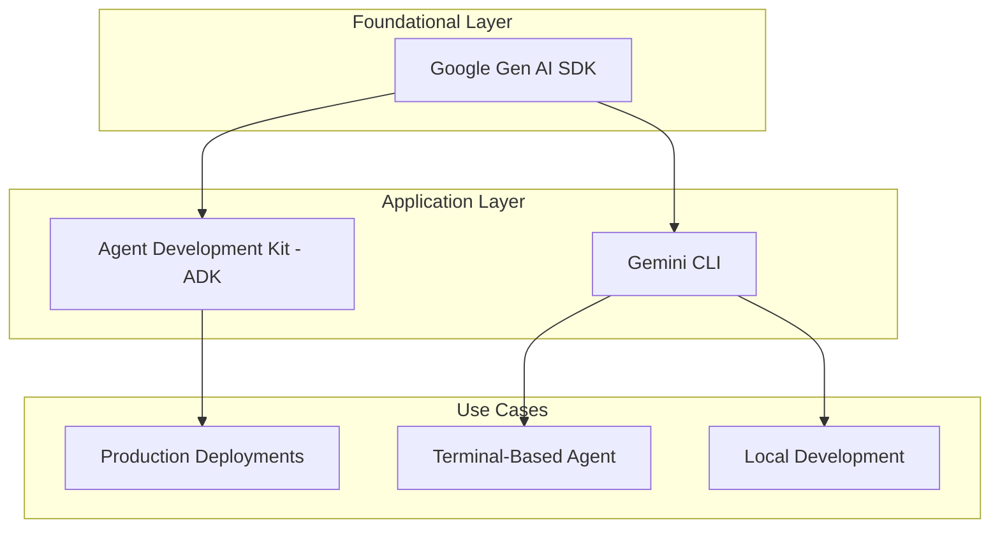
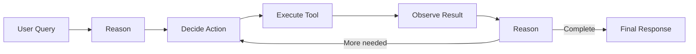
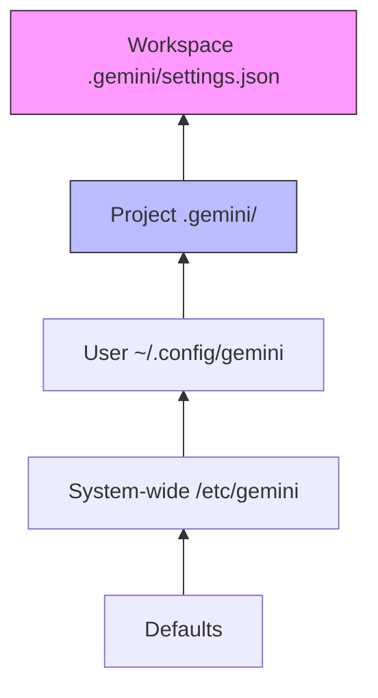
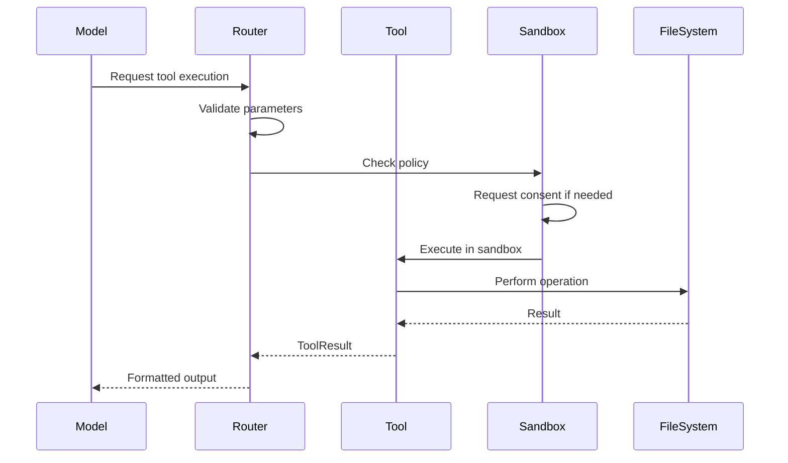
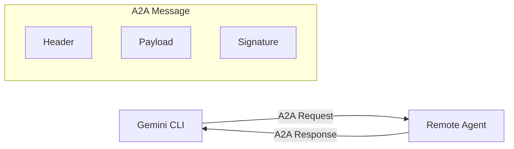

# Gemini CLI SDK Integration Guide

This document provides comprehensive documentation for integrating Google's Gemini CLI and related AI ecosystem with Agent Backplane.

## ABP status (this repository)

This workspace includes a runnable Gemini CLI backend integration scaffold:

- `hosts/gemini/host.js` (ABP sidecar entry point)
- `hosts/gemini/adapter.js` (Gemini CLI command adapter)
- `hosts/gemini/capabilities.js` (manifest)
- `crates/abp-gemini-sdk` (Rust registration shim for `sidecar:gemini`)

Activation:

```bash
cargo run -p abp-cli -- run --task "audit the repo" --backend sidecar:gemini
```

The adapter executes Gemini CLI by default through `gemini` and can be pointed at a custom runner via:

- `ABP_GEMINI_CMD`
- `ABP_GEMINI_ARGS`
- `ABP_GEMINI_RUNNER`
- `ABP_GEMINI_RUNNER_ARGS`
- `ABP_GEMINI_ADAPTER_MODULE`

## A. Taxonomy of Google's AI Ecosystem

Google's AI landscape consists of several interconnected but distinct layers:



### Google Gen AI SDK

The **Google Gen AI SDK** is the foundational API layer for interacting with Gemini models:

- **Purpose**: Low-level API for direct model interaction
- **Languages**: Python, JavaScript/TypeScript, Go, Java
- **Scope**: Model inference, token streaming, basic tool use
- **Authentication**: API Key, OAuth 2.0, Vertex AI ADC
- **Use Case**: Building custom integrations from scratch

### Agent Development Kit - ADK

The **Agent Development Kit** builds on Gen AI SDK to provide agent orchestration:

- **Purpose**: Framework for building production agents
- **Key Components**: `LlmAgent` class, tool registration, multi-agent orchestration
- **Deployment**: Cloud Run, GKE, or custom infrastructure
- **Use Case**: Production-grade agent systems with complex workflows

### Gemini CLI

The **Gemini CLI** is a terminal-based agent interface:

- **Purpose**: Interactive agent access from command line
- **Architecture**: ReAct paradigm with 1M token context
- **Extensibility**: MCP servers, custom commands, subagents
- **Use Case**: Development, debugging, local automation

### Relationship Summary

| Component | Layer | Primary Consumer | Complexity |
|-----------|-------|------------------|------------|
| Gen AI SDK | Foundational | Library developers | Low |
| ADK | Application | Agent engineers | Medium |
| Gemini CLI | Interface | End users | Low |

## B. Gemini CLI Architecture

### ReAct Paradigm - Reason and Act Loop

Gemini CLI implements the ReAct pattern:



**Loop Components:**

1. **Reasoning**: Model analyzes current state and determines next step
2. **Action Selection**: Choose appropriate tool or command
3. **Execution**: Run selected tool with parameters
4. **Observation**: Process tool output
5. **Iteration**: Continue until task complete

### 1M Token Context Window

Gemini CLI leverages Gemini's extended context:

- **Effective Capacity**: ~1 million tokens input
- **Use Cases**: Large codebases, extensive documentation, long conversations
- **Memory Management**: Automatic summarization for extremely long sessions

**Context Allocation:**

| Component | Typical Allocation |
|-----------|-------------------|
| System Instructions | 1-5k tokens |
| GEMINI.md | 5-20k tokens |
| Conversation History | Variable |
| File Contents | Variable |
| Response Generation | 8k tokens reserved |

### Token Caching and Checkpointing

**Token Caching:**

- **Purpose**: Reduce costs and latency for repeated context
- **Scope**: System instructions, GEMINI.md, frequently accessed files
- **TTL**: 60 minutes default
- **Cost Savings**: Up to 75% on cached tokens

**Checkpointing:**

- **Purpose**: Resume long-running sessions
- **Mechanism**: State serialization at reasoning boundaries
- **Storage**: Local filesystem in `.gemini/` directory

### Installation Methods

```bash
# npm global install
npm install -g @anthropic-ai/gemini-cli

# npx one-off
npx @anthropic-ai/gemini-cli

# Homebrew - macOS
brew install gemini-cli

# Direct binary download
curl -sSL https://gemini.ai/cli/install | sh

# From source
git clone https://github.com/google/gemini-cli
cd gemini-cli && npm install && npm link
```

### Authentication Strategies

| Method | Use Case | Setup |
|--------|----------|-------|
| OAuth 2.0 | Personal use | `gemini auth login` |
| API Key | CI/CD, scripts | `GEMINI_API_KEY` env var |
| Vertex AI ADC | GCP production | `gcloud auth application-default login` |
| Service Account | Enterprise | `GOOGLE_APPLICATION_CREDENTIALS` env var |

**Authentication Priority:**

1. `GEMINI_API_KEY` environment variable
2. `GOOGLE_APPLICATION_CREDENTIALS` for Vertex AI
3. OAuth tokens from `gemini auth login`
4. Application Default Credentials

## C. Configuration Hierarchy

Gemini CLI uses a layered configuration system:



### Configuration Layers - Lowest to Highest Priority

1. **System-wide**: `/etc/gemini/settings.json`
   - Admin overrides for enterprise deployments
   - Policy restrictions

2. **User Settings**: `~/.config/gemini/settings.json`
   - Personal preferences
   - Default model selection
   - API endpoint configuration

3. **Project Settings**: `.gemini/settings.json`
   - Project-specific tools
   - MCP server configurations
   - Context files

4. **Workspace Settings**: `.gemini/workspace.json`
   - Per-workspace overrides
   - Session-specific configuration

### Settings.json Schema

```json
{
  "model": "gemini-2.0-flash",
  "coreTools": ["file_read", "file_write", "shell_execute"],
  "excludeTools": ["web_search"],
  "mcpServers": {
    "filesystem": {
      "command": "mcp-filesystem",
      "args": ["--root", "."],
      "env": {}
    }
  },
  "contextFiles": ["GEMINI.md", "README.md"],
  "shell": {
    "allowedCommands": ["git", "npm", "cargo"],
    "sandbox": "seatbelt"
  },
  "output": {
    "format": "stream",
    "verbosity": "normal"
  }
}
```

### Key Configuration Fields

| Field | Type | Description |
|-------|------|-------------|
| `coreTools` | string[] | Tools enabled by default |
| `excludeTools` | string[] | Tools explicitly disabled |
| `mcpServers` | object | MCP server configurations |
| `contextFiles` | string[] | Files auto-loaded into context |
| `shell.allowedCommands` | string[] | Whitelist for shell execution |
| `shell.sandbox` | string | Sandboxing strategy: none, seatbelt, docker |

## D. Context Engineering

### GEMINI.md Files - Project Memory

GEMINI.md serves as persistent project memory:

```markdown
# Project Context

## Architecture
This is a Rust workspace with the following crates:
- abp-core: Stable contract types
- abp-runtime: Orchestration layer

## Conventions
- Use `cargo fmt` before commits
- All public APIs need documentation

## Common Tasks
- Build: `cargo build --all`
- Test: `cargo test --workspace`
```

**GEMINI.md Location Priority:**

1. Workspace root: `./GEMINI.md`
2. Parent directories up to home
3. User default: `~/.config/gemini/GEMINI.md`

### /memory Tool System

The `/memory` command manages persistent context:

| Command | Description |
|---------|-------------|
| `/memory add <text>` | Add fact to session memory |
| `/memory list` | Show stored memories |
| `/memory clear` | Clear session memory |
| `/memory save` | Persist to GEMINI.md |
| `/memory load` | Reload from GEMINI.md |

**Memory Scope:**

- **Session**: Cleared on exit
- **Project**: Stored in `.gemini/memory.json`
- **Global**: Stored in `~/.config/gemini/memory.json`

### .geminiignore Patterns

Control which files Gemini can access:

```gitignore
# Secrets - never expose
.env
*.pem
*.key
credentials.json

# Build artifacts - waste of tokens
target/
node_modules/
dist/

# Large files - exceed context
*.zip
*.tar.gz
*.mp4
*.pdf

# Sensitive directories
.ssh/
.gpg/
```

**Pattern Syntax:**

- Same as `.gitignore`
- Supports negation with `!`
- Relative to workspace root

## E. Custom Commands and Injection Syntax

### TOML Command Definitions

Custom commands are defined in `.gemini/commands.toml`:

```toml
[commands.test]
description = "Run project tests"
prompt = "Run the test suite and report results"

[commands.build-release]
description = "Build optimized release binary"
prompt = "Build the project in release mode"

[commands.explain]
description = "Explain code at cursor"
prompt = "Explain the code in {{file}} at line {{line}}"
```

### Variable Injection

| Syntax | Description | Example |
|--------|-------------|---------|
| `{{args}}` | All command arguments | `test -- --nocapture` |
| `{{file}}` | Current file path | `src/main.rs` |
| `{{line}}` | Current line number | `42` |
| `{{selection}}` | Selected text | `fn main() {}` |
| `{{clipboard}}` | Clipboard contents | - |

### Shell Execution with !{...}

Execute shell commands inline:

```
Analyze the output of !{git log --oneline -10}
```

**Security Model:**

- Commands run in sandbox by default
- Requires approval for file modifications
- Network access controlled by policy

### File Injection with @{...}

Include file contents directly:

```
Review the implementation in @{src/lib.rs}
```

**Supported Prefixes:**

| Prefix | Description |
|--------|-------------|
| `@{path}` | Single file |
| `@{glob*}` | Glob pattern |
| `@{dir/}` | Directory tree |

## F. Tools API

### BaseTool Interface

```typescript
interface BaseTool {
  name: string;
  description: string;
  parameters: JSONSchema;
  execute(context: ToolContext): Promise<ToolResult>;
}

interface ToolContext {
  workspace: Workspace;
  consent: ConsentManager;
  logger: Logger;
  abortSignal: AbortSignal;
}

interface ToolResult {
  output: string;
  artifacts?: Artifact[];
  error?: ToolError;
}
```

### Built-in Tools

| Tool | Description | Capabilities |
|------|-------------|--------------|
| `file_read` | Read file contents | Path validation, encoding detection |
| `file_write` | Create or overwrite files | Consent required, backup option |
| `file_edit` | Apply patches/diffs | Unified diff format |
| `shell_execute` | Run shell commands | Sandboxed, timeout control |
| `web_search` | Search the web | Rate limited, cost tracking |
| `web_fetch` | Fetch URL contents | Size limits, content type filtering |
| `memory` | Manage context | CRUD operations on memory store |

### Tool Execution Flow



## G. MCP Integration

### Server Configuration

```json
{
  "mcpServers": {
    "filesystem": {
      "command": "mcp-server-filesystem",
      "args": ["--root", "/workspace"],
      "env": {
        "LOG_LEVEL": "debug"
      }
    },
    "database": {
      "command": "mcp-server-postgres",
      "args": ["--connection-string", "${DB_URL}"],
      "env": {}
    }
  }
}
```

### Transport Layers

| Transport | Protocol | Use Case |
|-----------|----------|----------|
| stdio | Standard I/O | Local processes, simple setup |
| HTTP | REST API | Remote servers, load balancing |
| SSE | Server-Sent Events | Real-time updates, streaming |

**stdio Transport - Default:**

```
Parent Process (Gemini CLI)
    ↓ stdin
    ↑ stdout
Child Process (MCP Server)
```

**HTTP Transport:**

```json
{
  "mcpServers": {
    "remote": {
      "url": "https://mcp.example.com/api",
      "headers": {
        "Authorization": "Bearer ${API_TOKEN}"
      }
    }
  }
}
```

### Authentication Patterns

**Static Headers:**

```json
{
  "headers": {
    "X-API-Key": "sk-xxxxx"
  }
}
```

**Application Default Credentials - ADC:**

```json
{
  "auth": {
    "type": "adc",
    "audience": "https://mcp.example.com"
  }
}
```

**OAuth 2.0:**

```json
{
  "auth": {
    "type": "oauth2",
    "clientId": "xxx",
    "clientSecret": "${OAUTH_CLIENT_SECRET}",
    "tokenUrl": "https://auth.example.com/token"
  }
}
```

## H. Subagents and A2A Protocol

### Subagent Definition

Subagents are specialized agents defined with YAML frontmatter:

```yaml
---
name: codebase-investigator
description: Analyzes codebase structure and dependencies
tools:
  - file_read
  - shell_execute
model: gemini-2.0-flash
max_tokens: 4096
---

You are a codebase investigation specialist. Your job is to:

1. Analyze project structure
2. Identify key dependencies
3. Map component relationships
4. Report findings in structured format

Focus on understanding over modification.
```

### Codebase Investigator Example

**File**: `.gemini/subagents/codebase-investigator.md`

```yaml
---
name: codebase-investigator
description: Deep analysis of codebase architecture
tools:
  - file_read
  - shell_execute
excludeTools:
  - file_write
  - web_search
timeout: 300
---

# Role
You are a senior architect analyzing an unfamiliar codebase.

# Process
1. Identify entry points
2. Map module dependencies
3. Document data flow
4. Identify patterns and anti-patterns

# Output Format
## Summary
Brief overview of the codebase purpose and structure.

## Architecture Diagram
Mermaid diagram showing component relationships.

## Key Findings
- Finding 1
- Finding 2

## Recommendations
- Recommendation 1
- Recommendation 2
```

### A2A Protocol - Agent-to-Agent

A2A enables communication between remote agents:



**Message Structure:**

```json
{
  "version": "a2a/v1",
  "from": "gemini-cli://local",
  "to": "agent://remote.example.com/investigator",
  "id": "msg-xxx",
  "timestamp": "2024-01-15T10:30:00Z",
  "payload": {
    "type": "task",
    "task": "Analyze the authentication module",
    "context": {...}
  },
  "signature": "sha256:..."
}
```

### YOLO Mode Considerations

**YOLO Mode**: Auto-approve all operations without consent prompts.

**Use Cases:**

- CI/CD pipelines
- Trusted environments
- Automated testing

**Risks:**

- Unrestricted file access
- Uncontrolled shell execution
- Potential data exfiltration

**Safe YOLO Configuration:**

```json
{
  "yolo": true,
  "yoloScope": {
    "maxFileSize": "1MB",
    "allowedPaths": ["./src", "./tests"],
    "deniedCommands": ["rm -rf", "sudo"],
    "networkEnabled": false
  }
}
```

## I. Security Framework

### Privacy and Consent Model

**Consent Levels:**

| Level | Description | User Interaction |
|-------|-------------|------------------|
| Auto | Safe operations | None required |
| Prompt | Potentially impactful | Single approval |
| Confirm | Destructive operations | Explicit confirmation |
| Deny | Policy violation | Blocked with explanation |

**Consent Categories:**

```json
{
  "consent": {
    "file_read": "auto",
    "file_write": "prompt",
    "file_delete": "confirm",
    "shell_execute": "prompt",
    "network_request": "prompt",
    "env_access": "confirm"
  }
}
```

### Sandboxing Options

**Seatbelt - macOS:**

```json
{
  "sandbox": {
    "type": "seatbelt",
    "profile": "readonly",
    "exceptions": ["/tmp/gemini-work"]
  }
}
```

**Docker:**

```json
{
  "sandbox": {
    "type": "docker",
    "image": "gemini-sandbox:latest",
    "volumes": [
      "${workspace}:/workspace:ro"
    ],
    "network": "none"
  }
}
```

**Native with Restrictions:**

```json
{
  "sandbox": {
    "type": "native",
    "fs": {
      "readonly": ["./src", "./docs"],
      "readwrite": ["./output"],
      "denied": [".env", "credentials"]
    },
    "network": {
      "allow": ["api.google.com"],
      "deny": ["*"]
    }
  }
}
```

### Threat Mitigation

| Threat | Mitigation |
|--------|------------|
| Prompt Injection | Input sanitization, role separation |
| Data Exfiltration | Network restrictions, audit logging |
| Code Execution | Sandboxing, allowlists |
| Privilege Escalation | Least privilege, no sudo |
| Token Theft | Secure storage, short-lived credentials |

## J. ADK - Agent Development Kit

### LlmAgent Class

```python
from google.genai import adk

agent = adk.LlmAgent(
    name="code-assistant",
    model="gemini-2.0-flash",
    instructions="You are a helpful coding assistant.",
    tools=[
        adk.file_read_tool(),
        adk.file_write_tool(),
        adk.shell_tool(allowed=["git", "npm"]),
    ],
    memory=adk.VolatileMemory(),
)
```

**Key Properties:**

| Property | Type | Description |
|----------|------|-------------|
| `name` | string | Agent identifier |
| `model` | string | Gemini model to use |
| `instructions` | string | System prompt |
| `tools` | list[Tool] | Available tools |
| `memory` | Memory | Session memory backend |
| `max_tokens` | int | Maximum response length |
| `temperature` | float | Sampling temperature |

### Multi-Language Support

| Language | Package | Status |
|----------|---------|--------|
| Python | `google-genai[adk]` | Stable |
| TypeScript | `@google/genai-adk` | Stable |
| Go | `google.golang.org/genai/adk` | Beta |
| Java | `com.google.genai:adk` | Alpha |

### Interactions API

```python
# Start an interaction
interaction = agent.start(
    message="Explain the authentication flow",
    context={"files": ["auth.py", "middleware.py"]}
)

# Stream responses
for event in interaction.stream():
    if event.type == "text":
        print(event.content)
    elif event.type == "tool_call":
        print(f"Calling tool: {event.tool_name}")

# Get final result
result = interaction.wait()
print(result.response)
```

### Deployment Options

**Cloud Run:**

```bash
# Build and deploy
adk deploy cloud-run \
  --agent agent.py \
  --service code-assistant \
  --region us-central1
```

**GKE:**

```bash
# Containerize
adk build docker --agent agent.py --tag gcr.io/proj/agent

# Deploy to GKE
kubectl apply -f agent-deployment.yaml
```

**Self-Hosted:**

```python
from flask import Flask, request
from google.genai import adk

app = Flask(__name__)
agent = adk.LlmAgent.from_config("agent.yaml")

@app.route("/chat", methods=["POST"])
def chat():
    message = request.json["message"]
    result = agent.run(message)
    return {"response": result.response}
```

## Integration with Agent Backplane

### Mapping Gemini Concepts to ABP

| Gemini CLI | Agent Backplane |
|------------|-----------------|
| Tool | `Capability` |
| MCP Server | `SidecarBackend` |
| GEMINI.md | `ContextPacket` |
| Settings | `RuntimeConfig` |
| Session | `WorkOrder` + events |
| Consent | `PolicyProfile` |

### Backend Implementation

```rust
// In abp-integrations
pub struct GeminiBackend {
    cli_path: PathBuf,
    config: GeminiConfig,
}

impl Backend for GeminiBackend {
    fn capabilities(&self) -> CapabilityManifest {
        CapabilityManifest {
            streaming: SupportLevel::Native,
            tools: SupportLevel::Native,
            web_search: SupportLevel::Native,
            // ... other capabilities
        }
    }
    
    fn run(&self, work_order: WorkOrder) -> impl Stream<Item = AgentEvent> {
        // Spawn gemini CLI as sidecar
        // Map JSONL events to ABP events
    }
}
```

### Cost Considerations

**WebSearch Pricing - NOT Free:**

| Operation | Cost |
|-----------|------|
| Web Search | $10 per 1,000 searches |
| Search Result Tokens | Input token rates apply |
| Grounding Tokens | Additional premium |

**Token Caching Savings:**

| Scenario | Without Cache | With Cache |
|----------|---------------|------------|
| 100k context, 10 calls | 1M tokens | 250k tokens |
| Estimated cost | $2.50 | $0.75 |

## References

- [Gemini CLI Documentation](https://ai.google.dev/gemini-api/docs)
- [Agent Development Kit](https://ai.google.dev/docs/adk)
- [MCP Specification](https://modelcontextprotocol.io)
- [A2A Protocol](https://a2a.dev)
